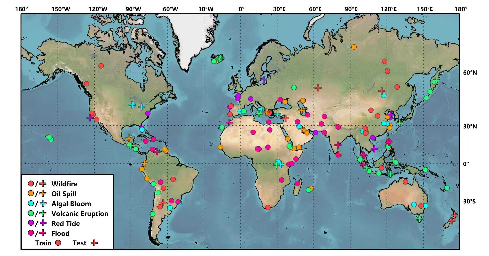
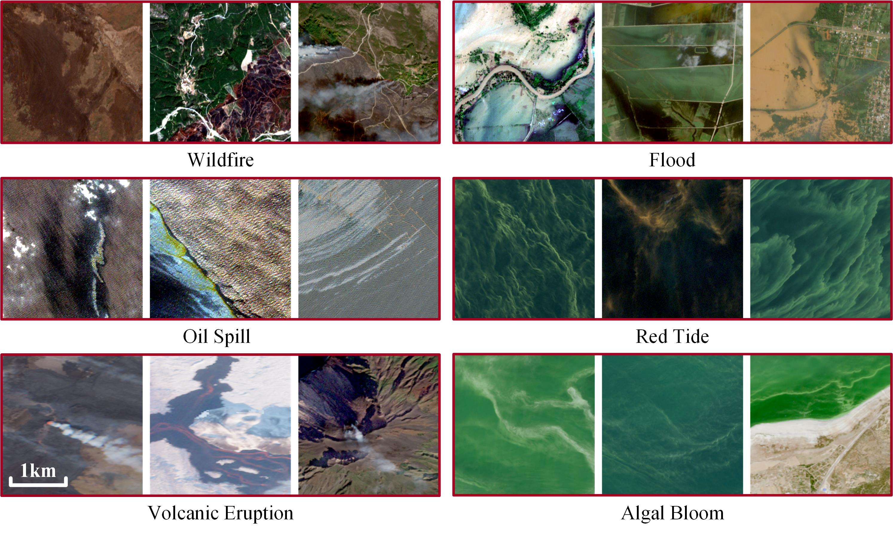

# SSF-GNN
Implementation of the paper "Towards Efficient Multi-hazard Detection from Single Satellite Imagery via Spectral-Semantic Graph Reasoning "

## S2MHD
S2MHD is a large-scale multi-hazard dataset constructed from Sentinel-2 imagery. It consists of images from 169 disaster events worldwide, which are categorized into seven classes. The dataset is available at [Sen2MHD](https://pan.baidu.com/s/1Rvr5jYEcW491OiZVjqe5qg?pwd=ppit).



## Project Structure
```text
Project/
├── README.md
├── requirements.txt
├── train.py
├── test.py
├── train/
│   ├── Algalbloom/
│   │   ├── 1.tif
│   │   ├── 2.tif
│   │   └── ...
│   ├── Flood/
│   │   ├── 1.tif
│   │   └── ...
│   ├── Normal/
│   │   └── ...
│   └── Oilspill/
│       └── ...
└── test/
    ├── flood/
    └── wildfire/
    └── ...
```
## Requirements
torch==2.6.0+cu126  
torch-geometric==2.6.1  
GDAL=3.10.2  
timm==1.0.21  

## Training
python train.py

## Testing
python test.py

